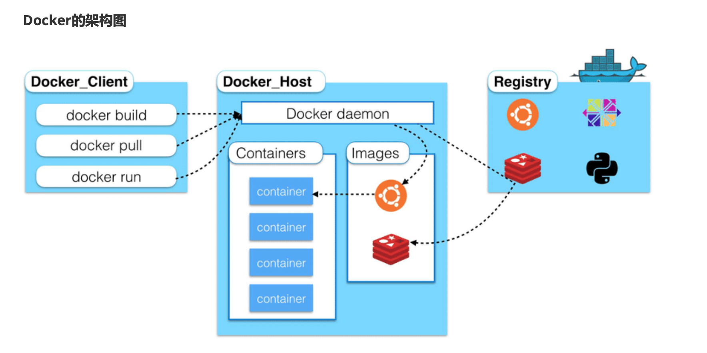
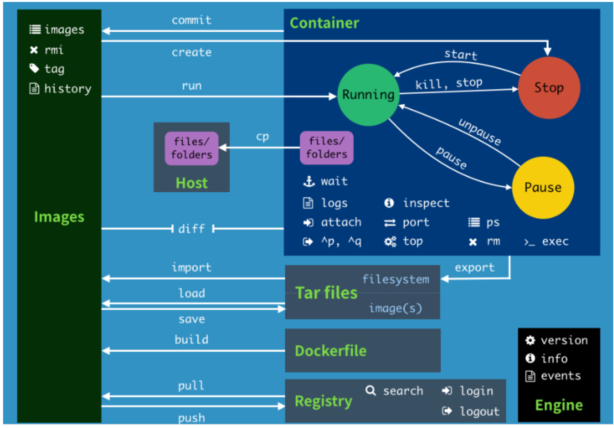
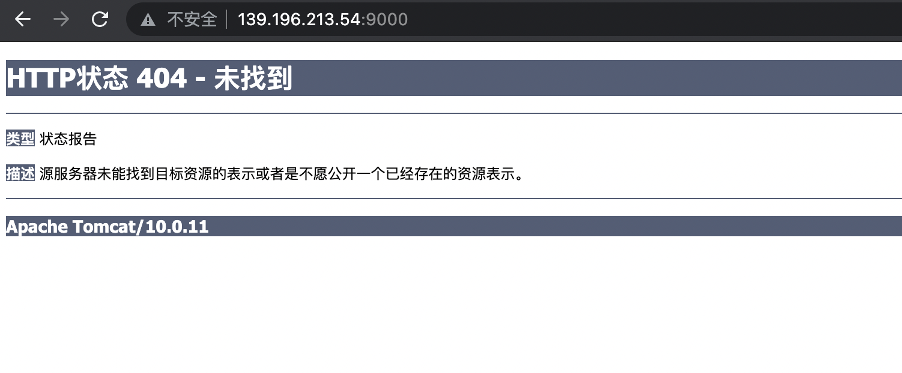
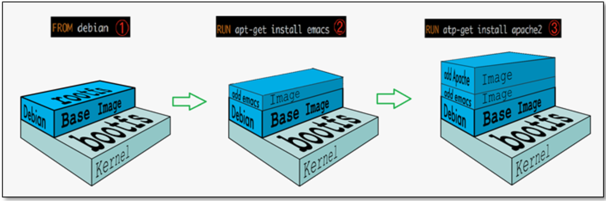
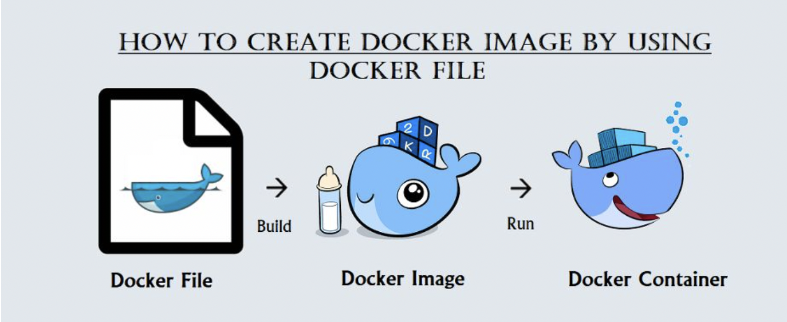
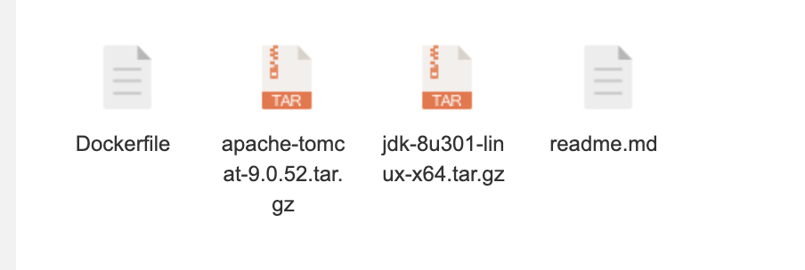

 

## Docker常用命令

​	安装按照docker官网步骤，只是要替换成阿里云镜像加速。

### 帮助命令

```bash
docker version			# 显示Docker版本信息
docker info				  # 显示docker系统信息
docker --help 		  # 帮助文档
```

---

### 镜像命令

```shell
docker images											 # 列出本地主机上的镜像
# 可选项	
-a			列出本地所有镜像
-q			只显示image id

docker pull [ImageID]	  		 				 # 去dockerhub上下载镜像

# 删除镜像
docker rmi -f [ImageID]  						# force image deletion
docker rmi -f $(docker images -aq)	# delete all images
```

---

### 容器命令

​	必须根据镜像创建容器，镜像和容器的关系就像类和实例

#### 新建容器并启动

```shell
docker run [options] Image [command]
# 常见参数
--name 	name    # 指定容器名字
-d							# 以后台形式运行容器，detach 分离
-it							# 以新终端交互运行
-P							# 随机端口映射
-p							# 指定端口映射
# 常用端口映射形式  hostPort:containerPort

# 例子，使用centos以交互模式运行，在容器内执行/bin/bash
docker run -it centos /bin/bash

docker run -d centos	# 后台启动centos
# 使用docker ps 查看发现容器已经停止
```

​		**docker容器后台运行时必须有一个前台进程，否则会自动停止容器。因此一般要使用前台进程的方式运行启动。**

​	不知道怎么启动停止了的centos？？？？

#### 列出容器

```shell
docker ps [option]   # 默认只列出正在运行的容器
-a 		# 所有容器， all
-q		# 只显示容器id， quiet
```

#### 退出容器

```shell
exit      # 退出容器
<C-p-q>   # 将容器放到后台
```

#### 启动停止容器

```shell
docker start 容器id或名字
docker restart containerID
docker stop containerID			# 停止容器
docker kill containerID			# 强制停止
```

#### 查看容器中的信息

```shell
docker top containerID     # 显示进程信息
docker inspect containerID # 显示容器元信息
```

#### 进入正在运行的容器

```shell
# 进入容器之后开启新终端，启动新进程
docker exec -it 容器id /bin/bash

# 进入容器正在执行的终端，不启动新进程
docker attach 容器id
```

从容器拷贝文件到主机

```shell
docker cp 容器id:容器内路径 主机目的路径
```

#### 总结图



```shell
attach    Attach to a running container   # 当前shell下连接指定运行容器
# 创建镜像的两种方式
build 		Build an image from a Dockerfile
commit 		Create a new image from a container changes 
cp 				Copy files/folders from the containers filesystem to the host path
diff 			Inspect changes on a container's filesystem  # 查看容器文件变化
exec			Run a command in an existing container
# 导出容器的内容流作为一个tar[对应 import]
export 		Stream the contents of a container as a tar archive
history 	Show the history of an image  # 查看镜像的的制作历史
images 		List images
import 		Create a new fielsystem image from the contents of a tarball
info 			Display system-wide information
inspect 	Return low-level information on a container
kill			Kill a running container
load 			Load an image from a tar archive  # 从tar包中加载一个image[对应 save]
# 登录到一个docker的源服务器，比如将将image上传到阿里云
login 		Register or Logini to the docker registry server
logs		  Fetch the logs of a container
# 查看映射端口对应的容器内部源端口
port		  Lookup the public-facing port which is NAT-ed to PRIVATE_PORT
pull			Pull an image or a repository from the docker registry server
push 		  Push an image or a repository to the docker registry server
restart	  Restart a running container
rm 				Remove one or more containers
rmi 			Remove one or more images
run       Run a command in a new container
create 		Create a new container 		# 创建一个容器但不启动
save      Save an image to a tar archive
search 		Search for an image on the docker hub
start 		Start a stopped containers
stop			Stop a runing containers
top				Lookup the running processes of a container
```

## 高级用法

### tomcat安装

```shell
docker pull tomcat 

docker run -d -p 9000:8080 --name mytomcat tomcat

docker exec -it mytomcat /bin/bash
# 进入容器之后发现webapps目录是空的，此时测试9000端口得到的是下图,需要执行
cp -r webapps.dist/* webapps     # 递归复制，这样在测试网页恢复正常
```




### 创建镜像

**根据已有镜像创建**

​	上面下载的tomcat官网有缺陷，可以像上面一样解决了之后将容器提交成为一个镜像。

上边的步骤完成之后

```shell
docker commit 容器id [image_name][tag]
-a   # 作者
-m   # 提交信息
# 例如
docker commit -a pychego -m "添加了webapps内容"  loving_robinson diytomcat:latest 
# loving_robinson 是容器名字
```


根据Dockerfile文件创建


### docker镜像核心原理

UnionFS(联合文件系统):Union文件系统(UnionFS)是一种分层、轻量级并且高性能的文件系统， 它支持对文件系统的修改作为一次提交来一层层的叠加，同时可以将不同目录挂载到同一个虚拟文件系 统下(unite several directories into a single virtual filesystem)。Union 文件系统是 Docker 镜像的基 础。镜像可以通过分层来进行继承，基于基础镜像(没有父镜像)，可以制作各种具体的应用镜像。

```
特性:一次同时加载多个文件系统，但从外面看起来，只能看到一个文件系统，联合加载会把各层文件
系统叠加起来，这样最终的文件系统会包含所有底层的文件和目录
```

docker的镜像实际上由一层一层的文件系统组成，这种层级的文件系统UnionFS。

bootfs(boot file system)主要包含bootloader和kernel, bootloader主要是引导加载kernel, Linux刚启 动时会加载bootfs文件系统，在Docker镜像的最底层是bootfs。这一层与我们典型的Linux/Unix系统是 一样的，包含boot加载器和内核。当boot加载完成之后整个内核就都在内存中了，此时内存的使用权已 由bootfs转交给内核，此时系统也会卸载bootfs。

rootfs (root file system) ，在bootfs之上。包含的就是典型 Linux 系统中的 /dev, /proc, /bin, /etc 等标 准目录和文件。rootfs就是各种不同的操作系统发行版，比如Ubuntu，Centos等等。




##  容器数据卷

卷就是目录或者文件，存在一个或者多个容器中，由docker挂载到容器，但不属于联合文件系统，因此 能够绕过 Union File System ， 提供一些用于持续存储或共享数据的特性:

卷的设计目的就是数据的持久化，完全独立于容器的生存周期，因此Docker不会在容器删除时删除其挂 载的数据卷。

**特点:**

1、数据卷可在容器之间共享或重用数据
 2、卷中的更改可以直接生效 3、数据卷中的更改不会包含在镜像的更新中 4、数据卷的生命周期一直持续到没有容器使用它为止

​	数据卷是双向绑定的（双向拷贝），以mysql为例，docker挂载(Monts)在linux某路径，docker2和docker3分别通过`--volumes-from` 和docker1共享数据；此时干掉docker1，docker2和docker3之间还可以数据共享。**只要还有一个容器在，共享的数据就不会丢失。**

### 挂载

```shell
docker run -it -v 宿主机绝对路径：容器内路径 imageId

# 两个路径是完全打通的
docker run -d -p 3310:3306 -v /home/mysql/conf:/etc/mysql/conf.d -v /home/mysql/data:/var/lib/mysql -e MYSQL_ROOT_PASSWORD=123456 --name mysql01 mysql

# 由此可见mysql镜像中mysql的配置文件位置和数据库信息的位置
```

### Dockerfile

​	服务器目录`/root/docker` 用来存放所有和容器相关的数据。

挂载时不指定路径默认的主机路径是`/www/server/docker/volumes`

```shell
docker volume ls
docker volume inspect sha256码				# 查看对应的主机目录
```


#### 通过Dockerfile文件构建

```shell
# 在/root/docker路径下创建文件dockerfile1
$ cat dockerfile1
FROM centos
VOLUME ["/dataVolumeContainer1", "/dataVolumeContainer2"]  #  匿名挂载，不推荐
CMD echo "------end------"
CMD /bin/bash

docker build -f /root/docker/dockerfile1 -t mycentos .     # 最后有一个点
-f  	 	# Dockerfile文件的路径
-t			# name:tag 两者一体

docker run -it ImageID  	# 此时不用自己进入/bin/bash, 镜像命令中已经包含了

# 此时，两个数据卷的内容就和主机共享了
```


### 匿名和具名挂载

```shell
# 匿名挂载
-v 容器内路径
# 不指定名字和主机对应路径，不好维护，通常使用 docker volume 命令查看

# 具名挂载
-v 卷名:容器内路径
docker run -d -P --name nginx02 -v nginxconfig:/etc/nginx nginx

# 此时只是有了名字，在主机内的路径和匿名挂载一样  /www/server/docker/volumes
```

判断挂载的是卷名还是本机目录名？

不是/开始就是卷名，是/开始就是目录名


## Dockerfile文件构建过程



### **基础知识:**

1、每条保留字指令都必须为大写字母且后面要跟随至少一个参数 2、指令按照从上到下，顺序执行
 3、# 表示注释 4、每条指令都会创建一个新的镜像层，并对镜像进行提交

### 指令

```shell
FROM               # 基础镜像，当前新镜像是基于哪个镜像的 
MAINTAINER         # 镜像维护者的姓名混合邮箱地址
RUN                # 容器构建时需要运行的命令
EXPOSE             # 当前容器对外保留出的端口
WORKDIR            # 指定在创建容器后，终端默认登录的进来工作目录，一个落脚点
ENV                # 用来在构建镜像过程中设置环境变量
ADD                # 将宿主机目录下的文件拷贝进镜像且ADD命令会自动处理URL和解压tar压缩包 
COPY               # 类似ADD，拷贝文件和目录到镜像中!
VOLUME             # 容器数据卷，用于数据保存和持久化工作
CMD                # 指定一个容器启动时要运行的命令，dockerFile中可以有多个CMD指令，但只有最 后一个生效!截断
ENTRYPOINT        # 指定一个容器启动时要运行的命令!在上一个命令的基础上追加，不截断
ONBUILD           # 当构建一个被继承的DockerFile时运行命令，父镜像在被子镜像继承后，父镜像的 ONBUILD被触发
```

**CMD**:Dockerfile 中可以有多个CMD 指令，但只有最后一个生效，CMD 会被 docker run 之后的参数 替换!

**ENTRYPOINT**: docker run 之后的参数会被当做参数传递给 ENTRYPOINT，之后形成新的命令组合!

> 自定义一个centos + tomcat



可在dockerhub的镜像版本位置查看镜像的Dockerfile。

**准备工作：**在目标路径中放入tomcat压缩包和jdk压缩包，新建Dockerfile文件

!(Docker.assets/image-20210923092714927.png)

Dockerfile内容

​	**Dockerfile的注释一定要额外写一行，和执行语句放在一行会报错**

```dockerfile
FROM centos
MAINTAINER pychego<614693063@qq.com>
# 将自述文件拷贝到容器
COPY readme.md /usr/local/readme.md   
# 压缩包会自动解压
ADD jdk-8u301-linux-x64.tar.gz /usr/local/  
ADD apache-tomcat-9.0.52.tar.gz /usr/local/ 

RUN yum -y install vim
# 设置登录落脚点
ENV MYPATH /usr/local		
WORKDIR $MYPATH

ENV JAVA_HOME /usr/local/jdk1.8.0_301
ENV CLASSPATH $JAVA_HOME/bin/dt.jar:$JAVA_HOME/lib/tools.jar
ENV CATALINA_HOME /usr/local/apache-tomcat-9.0.52
ENV CATALINA_BASE /usr/local/apache-tomcat-9.0.52
ENV PATH $PATH:$JAVA_HOME/bin:$CATALINA_HOME/bin:$CATALINA_HOME/bin
# 监听容器内的8080端口
EXPOSE 8080
# 启动容器时启动tomcat 
CMD /usr/local/apache-tomcat-9.0.52/bin/startup.sh && tail -F /usr/local/apache-tomcat-9.0.52/bin/logs/catalina.out
```

#### 建立镜像启动容器

```shell
docker build -t diytomcat .

docker run -d -p 9000:8080 --name mydiytomcat -v /root/docker/data/tomcat/webapps/test:/usr/local/apache-tomcat-9.0.52/webapps/test -v /root/docker/data/tomcat/logs/:/usr/local/apache-tomcat-9.0.52/logs --privileged=true diytomcat
# 启动镜像不知道能不能把webapps整个文件夹挂载出来，每次这样试都得到上图的404
```


