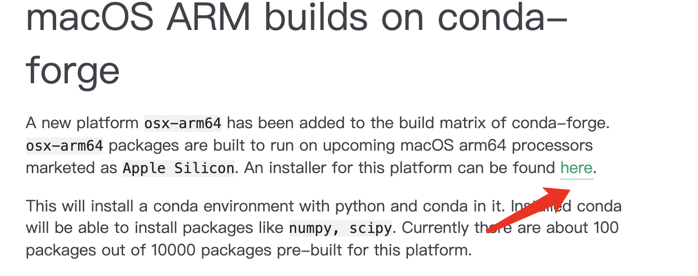
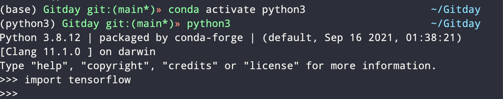

## M1安装tensorflow

​	首先要安装arm架构的[anaconda](https://conda-forge.org/blog/posts/2020-10-29-macos-arm64/)，我在安装之前把原来的anaconda卸干净了。



点击即可下载。之后将下载文件拖到terminal按照提示安装。

或者切换到该文件所在目录，执行

```bash
bash Miniforge3-MacOSX-arm64.sh
```

之后切换到用户主目录，执行`conda`不报错则安装成功

之后将这个[网页](https://raw.githubusercontent.com/mwidjaja1/DSOnMacARM/main/environment.yml)内容复制下来，到一个`.yml`文件中，比如我在用户主目录新建一个`a.yml`文件，将网站的内容粘里面。这里面包含要安装的python版本和依赖。切换到用户主目录

#### 创建虚拟环境

```bash
conda env create --file=a.yml --name python3
```

最后的python3是我自己给这个环境起的名字，可以自定义。

在切换到创建好的环境

```bash
conda activate python3
```

执行

```bash
pip install --upgrade --force --no-dependencies https://github.com/apple/tensorflow_macos/releases/download/v0.1alpha3/tensorflow_macos-0.1a3-cp38-cp38-macosx_11_0_arm64.whl https://github.com/apple/tensorflow_macos/releases/download/v0.1alpha3/tensorflow_addons_macos-0.1a3-cp38-cp38-macosx_11_0_arm64.whl
```

执行成功即安装完成，但是我还遇到了`import tensorflow`或者`import numpy`报错说要检查numpy和python的版本的问题，

执行下面的命令

```bash
pip uninstall -y numpy
pip uninstall -y setuptools
pip install setuptools
pip install numpy
# 在执行第三条命令时可能会报错，不用管他
```

之后再`import tensorflow`进行测试




