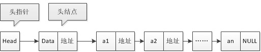

## C语言一级指针和二级指针

​	在通过函数交换两个变量的值时，仅仅是交换了两个变量的值，并没没有改变指针的指向，因此传入的是一级指针。

​	而在更改链表时，看的书上一般都是传入二级指针，因为这时候改变了指针的指向。但实际上，**只要不更改头指针，只传入一级指针就足够了。**

```c
#include<stdio.h>
#include<stdlib.h>
#define MAXSIZE 20
typedef struct Node
{
    int data;
    struct Node *next;
}Node;
typedef struct Node *LinkList; /* 定义LinkList */;
// LinkList L 相当于传入头指针，LinkList *L 相当于传入头指针的指针
int Init(LinkList L){
    L =(LinkList)malloc(sizeof(Node));
    L->next = NULL;
}

int main(){
    LinkList L = NULL;
    printf("%p\n", L);  // 0x0  
    Init(L);
    printf("%p\n", L);  // 0x0  
}
```

在上面的例子中，因为要修改指针的指向，所以要传入二级指针才行，传入指针本身函数返回之后并没有任何变化。

