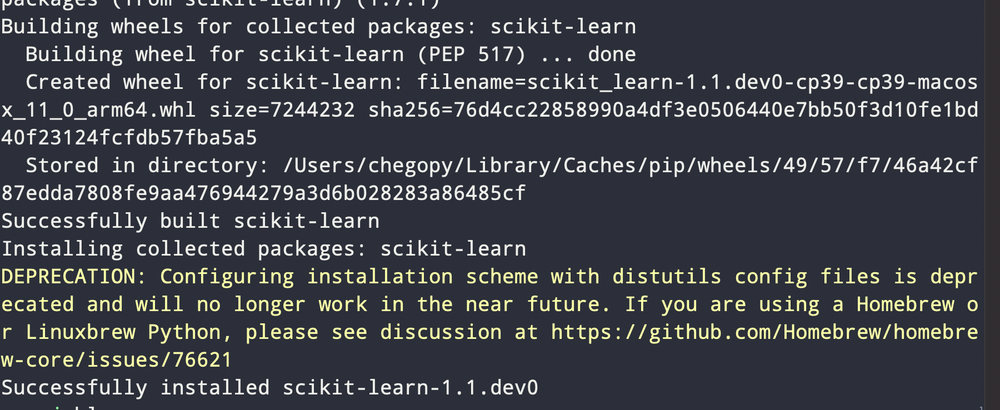

### Mac不依靠conda环境安装机器学习库

  一般需要安装`numpy`,`pandas`,`scipy`,`scikit-learn`
我使用pycharm时用conda环境安装过这几个库，都能安装上，但是安装了vim之后不知道怎么让vim使用conda的python，就整了很长事件在brew的python上安装了这几个库。

在终端安装之前，如果有安装anaconda的话，需要用下面的命令暂时关闭conda环境

```bash
$ conda deactivate    
```

`numpy`和`pandas`的安装比较简单
```bash
$ pip install numpy
$ pip install pandas
```

安装scipy之前需要安装`matplotlib`,也是直接安装即可。

安装scipy时要用

```bash
$ brew install scipy
```

之后安装`scikit-learn`我用的命令是

```bash
$ pip install --pre --extra-index https://pypi.anaconda.org/scipy-wheels-nightly/simple scikit-learn
```



以后库安装不上还是要到官网寻求帮助！
